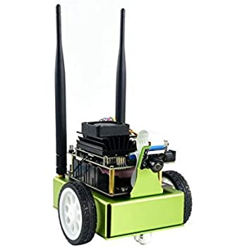

### jetbot_opencv_project_____RAPA

# Nvidia Jetbot Tracking the Road with Camera by OpenCV

  

## Development environment
Python, Opencv, SSH, Nvidia Jetbot

## Contents
- Detecting Lane and Tracking the Road
- Collision Avoidance
- Stopping at CrossWalk
